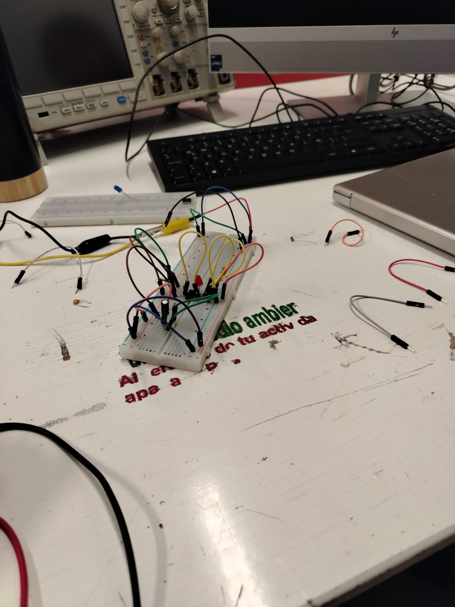
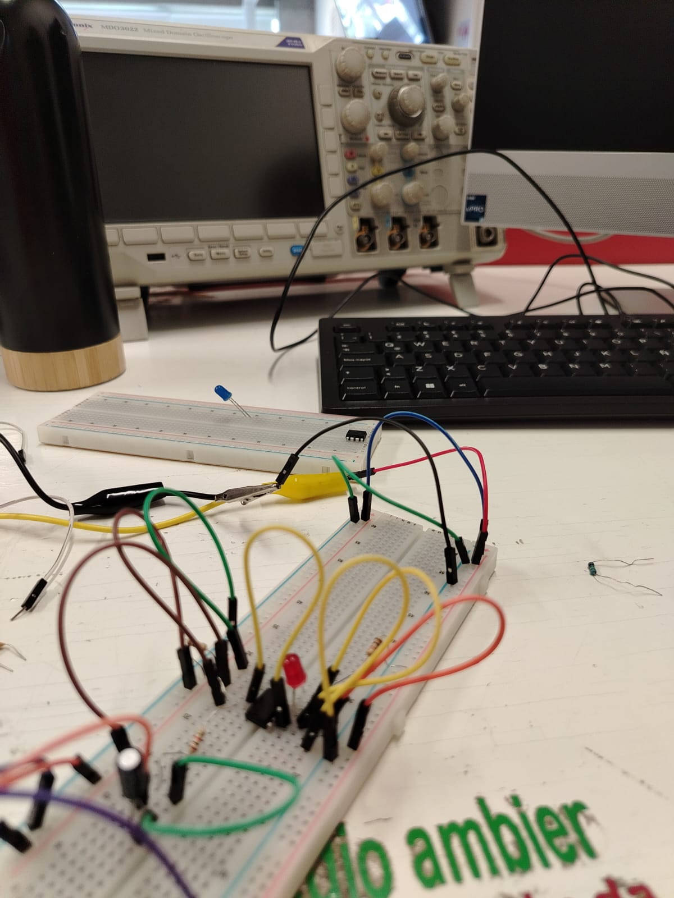
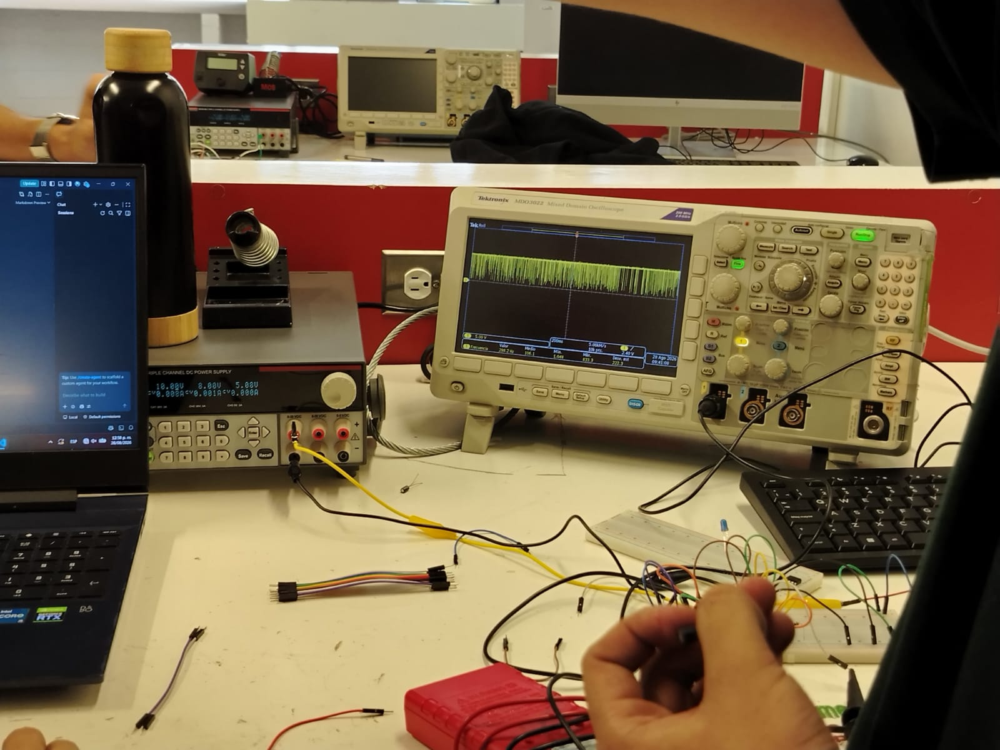

# Sesion número 2 de mecatrónica
El día de hoy, el profesor nos enseño lo basico acerca de la electrónica. La ley de ohm, que es el voltaje, la corriente y la resistencia, como interactuan cada una con el entorno , que es corriente alterna y corriente continua y así, lo básico. Me confundió bastante lo del voltaje eso si, según yo era la diferencia de potencial del circuito, claro, funciona como la fuerza de la electricidad commo nos explicaron en clase, pero según yo esa definición estaba mal. De ahí enfuera, todo estuvo muy bien.

Despúes nos explicaron rapidamente lo que era un capacitor y un contador, para posteriormente, ponernos a realizar la cosntrucción de un circuito dentro de una protoboard, viendo el sketch de uno de tinkercard. Se trataba de un led que parpadeaba, algo básico.

A mi pareja y y a mi nos costo bastante armar el proto, y eso que se supone yo ya tengo experiencia armandolo. Al final resulta que habíamos conectado mal un cable, y si pudo funcionar al final.

Al finalizar, el profesor conecto el osciloscópio al circuito hecho, para poder mostrarnos como se veía la corriente dentro del circuito.

# (Ahí no se ve mucho, eso es unicamente ruído)

Eso fue todo por la práctica del día de hoy. Publicaría videos, pero todavía no se como, para la siguiente sesión ya debería haber aprendido el como.

