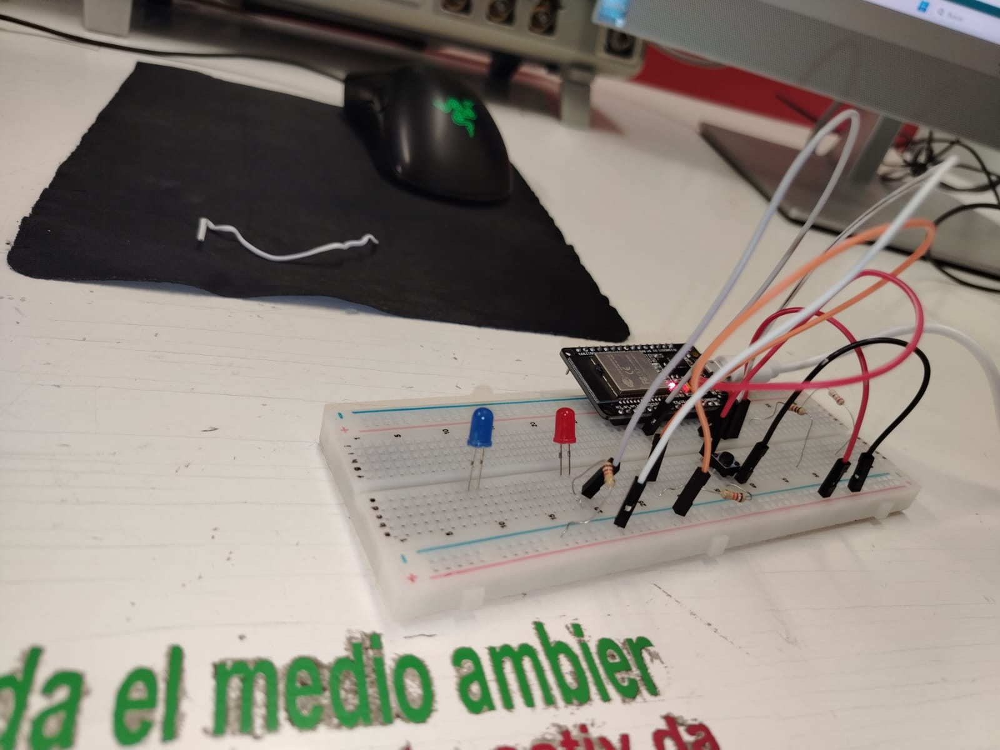
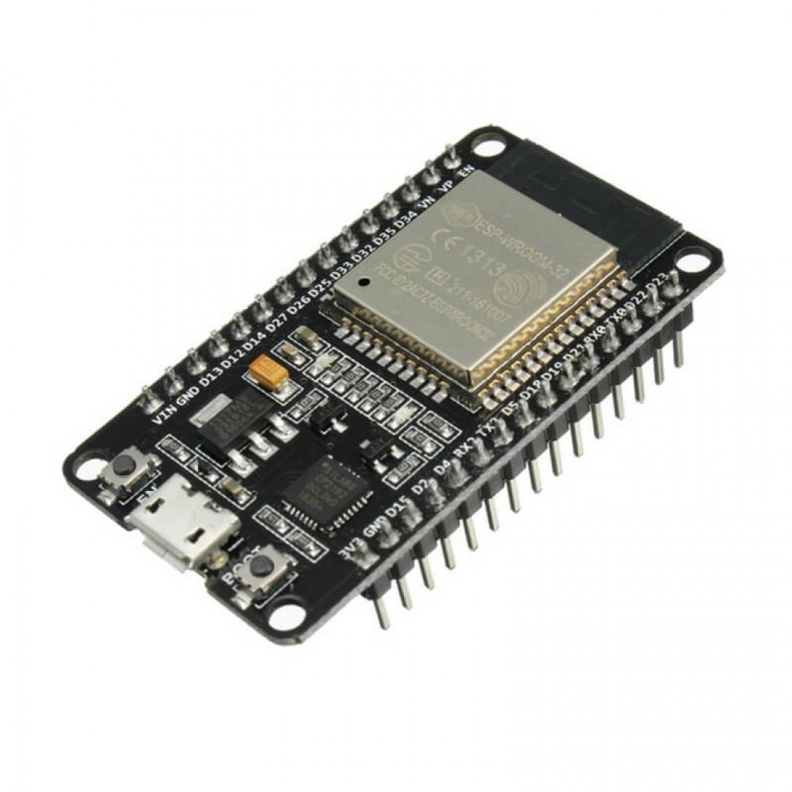

# Sesión número 3 de Mecatrónica (4 de septiembre de 2026)
El día de hoy, Oliver nos enseño lo básico de los arduinos y del programa para poder subirles codigo del mismo nombre. Primero, nos mostro las cosas básicas del programa arduino, como que el lenguaje usado es una variante muy cercana al c++, al igual que los tipos de datos que hay (Int, Char, Float, etc.). Despues, nos enseño como funciona el Void setup **(Que es donde se coloca toda la base del codigo)** y el void loop **(Que es donde se crea el codigo que se repetira una y otra vez)**, para posteriormente, ponernos a hacer ya la prática real. ()

### Blinker
Como todo buen ingeniero, Oliver nos dio unas protoboards, leds y resistencias para hacer nuestro primer blinker jaja. Mi compañero Andrés y yo hicimos el blinker bastante rápido, con un intervalo de 500ms, (5 segundos). Luego, le agregamos otro led para que intercalara el parpadeo con el anterior, haciendo que uno estuviera encendido y el otro no, como sirena de policía.

**Hay que aclarar que nosotros no subimos el codigo a un arduino UNO normal, que es el mas común, si no, que lo subimos a una version llamada ESP 32, uno que yo nunca había usado antes, pero considero que es mejor que el arduino normal, pues tiene ya batería integrada, conexión a Bluetooth e internet, y llo mas importante en mi opinión, es mucho más pequeño, al igual que se puede insertar en una protoboard.**
Algo así mas o menos:

### Monitor Serial
Despúes de los blinkers, Oliver nos explico el como funciona el **Monitor serial**, que es una manera de leer información que esta mandando el Arduino. NOs explico como se instala en el Setup, que el valor mas compun a utilizar en el monitor es de 9600, y el como utilizarlo dentro del codigo en Loop. Después, nos puso a hacer una práctica, donde si presionabamos un boton, el monitor serial decia que se estaba presiondnado, y que cuando no se presionaba, el monitor serial decía que no se estaba presionando. A mim compañero y a mí se nos facilitó bastante la verdad.

### Monitor Serial Bluetooth
Por último, debimos hacer la práctica del momnitor serial pero esta vez usando el celular. Gracias al arduino ESP 32, podemos hacer que el monitor serial se conecte esta vez al celular via Blueetoth, y mandar señales desde ahí, por lo que la práctica ahora se trato de lograr hacer que, desde el celular mandabas la señalm de encendido, y un LED se encendía, madnabas la señla de apagado, y un LED se apagaba. 

**[Video de como terminó funcionando](https://youtube.com/shorts/SqflYt2NLWU?si=gSgfeWqXUEN6f58n)**

Eso fue basicamente todo por el día de hoy. La verdad, tengo muy poca evidencia en video y en fotografía, porque mi compañero y yo estabamos tan memtidos en la práctica que apenas recordamos a mitad de clase que se debe de documentar todo lol que veamos. La próxima sesión ya tendré todo mejor organizado.