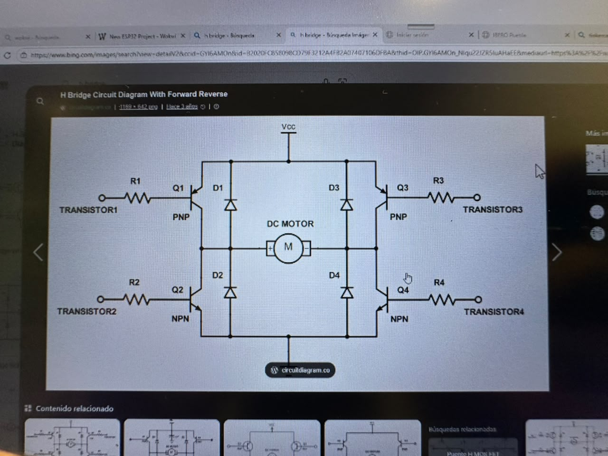
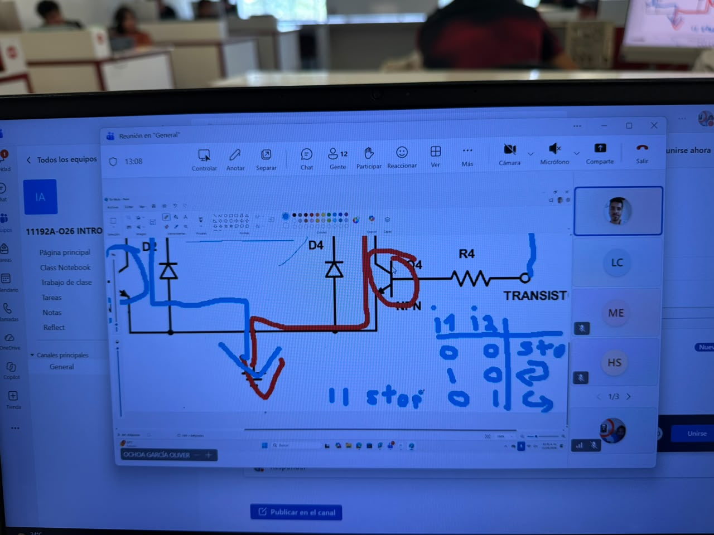
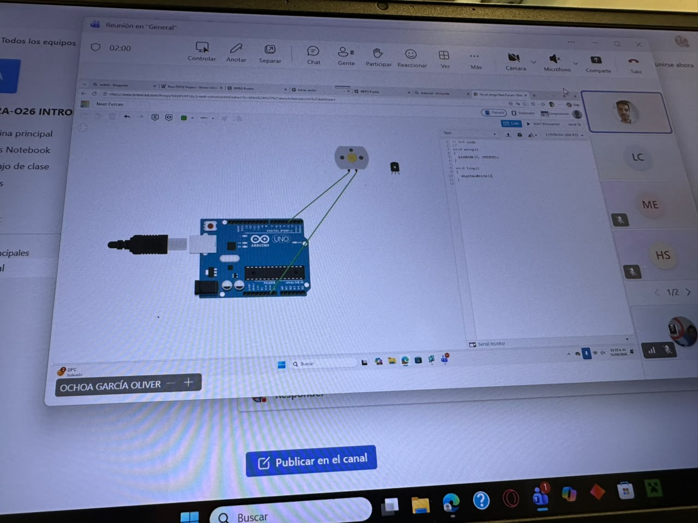
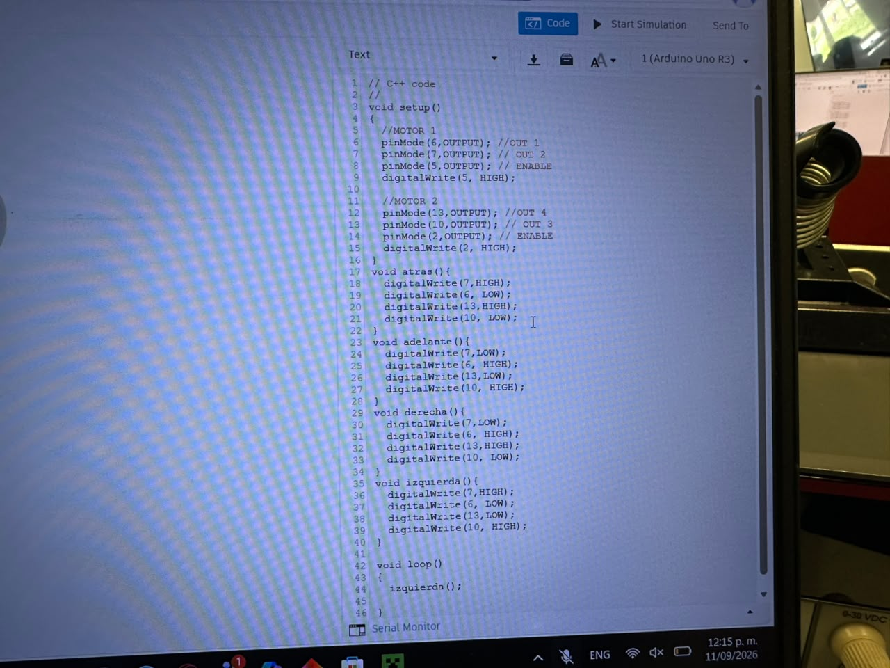
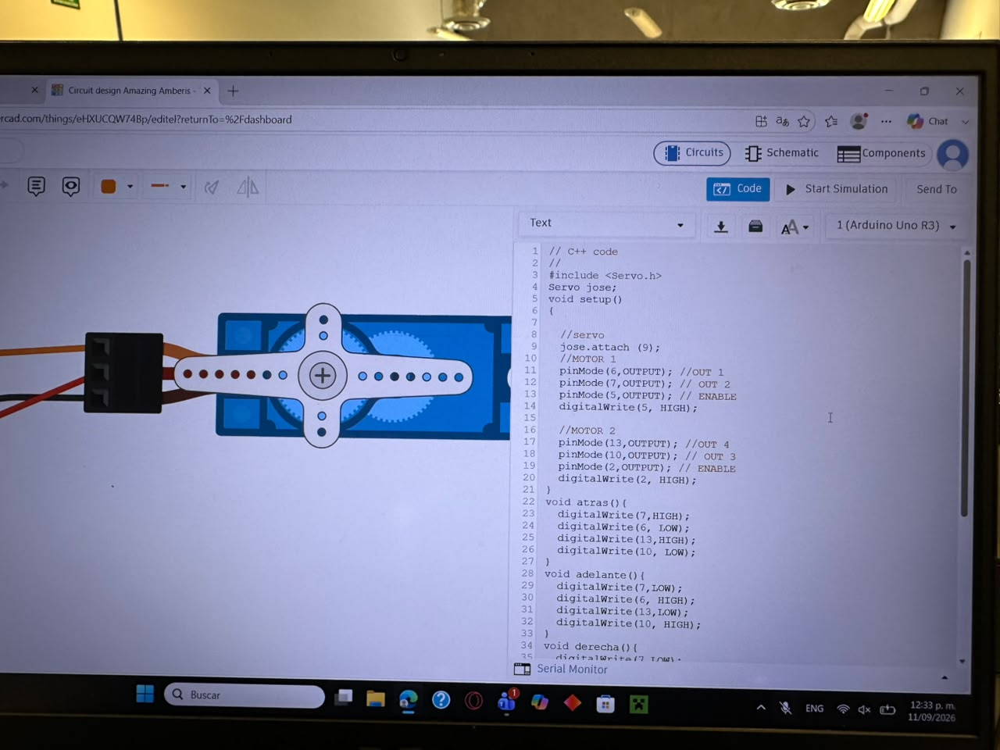

# Sesión número 4 de mecatrónica (11 de septiembre de 2026)
El día de hoy, Oliver se chuto un speedrun acerca de lo básico de motores, me imagino que para ya tener todas las bases para poder realizar nuestro proyecto, el cual es cochecitos que se controlen a control remoto para jugar futbol.
Primero, se nos explico como funciona el motor DC, que hacer para que gire de un lado a otro, como es que se comporta el amperaje y el voltaje en el motor y el como se transfiere la energía en el motor. Luego, pasamos a como utilizarlos de manera más sencilla.

### Puente H
Para poder cambiar la dirección de un motor, se debe de invertir la corriente, cosa que es "complicada", pero con un puente H, se facilita la cosa muchísimo más, pues este es un circuito que invierte la polaridad del motor, facilitando más ell control de los motores.
Se ve así:

Despúes de que se nos explicara el funcionamiento de los puentes H, Olvier nos puso a hacer circuitos con estos en Tinkercad, para irle agarrando lla onda. Como es que se concetan, como evitar que se quemen los arduinos y como programar el funcionammiento de los Puente H en Arduino.

**[Video de los motores](https://youtu.be/iViztAziWw4)**

Después de haber ya cableado y creado bien el setup, Oliver nos enseño a crear funciones. Para poder direccionar bien ambos motores para que se mueva comodamente. Se requiere un alrededor de 8 lineas de codigo para crear una dirección, pues tienes que encender o apagar cada puerto  para definir bien la direccion de los motores, pero creando la función, puedes ya dejar definida la dirección en el setup, para soolo tener que llamarla cuando la necesites, haciendo que el codigo sea muchísimo más facil de escribir.

### Servo Motor
Para finalizar la clase, Oliver nos enseño como usar un Servo motor, es un motor pequeño que esta hecho para hacer movimientos precisos, funciona con grados. Se nos enseño como agregar la libreria en el código, como ponerele un nommbre, como conectarlo y por útlimo, como hacer que gire cierta cantidad de grados.

Esa fue la clase del día de hoy, la verdad, parece que fue poco, pero fue bastante información de cosas bastante sencillas. Aunque, considero que ya estamos mmucho más cerca de poder realizar el proyecto que se nos fue asignado para este semestre.