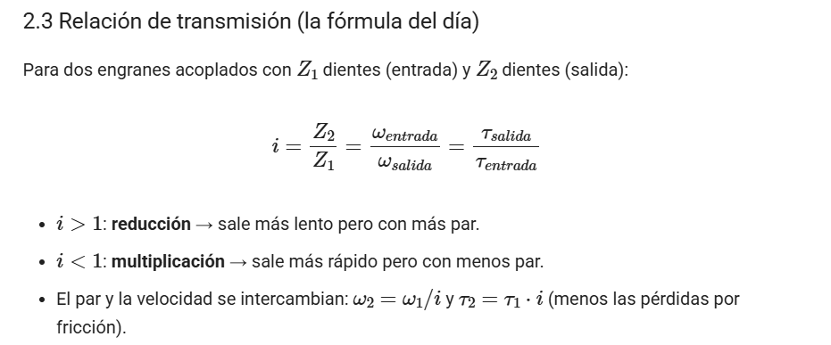
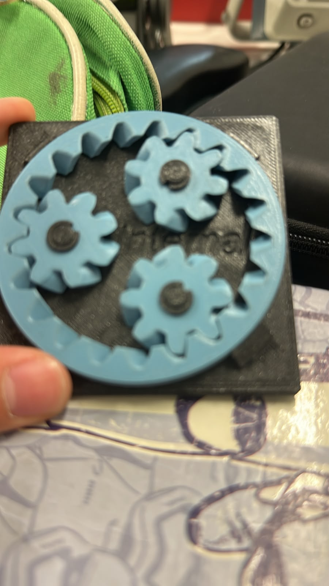
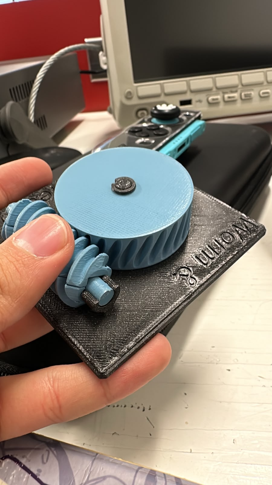

# Sesión número 5 de mecatrónica (18 de septiembre de 2026)
Despúes de ya haber explorado lo esencial de electrónica y programación para el proyecto, faltaba la parte mecánica de este, por lo que Oliver nos dió una clase pequeña, pero muy muy útil acerca de engranajes.

Para empezar, nos enseño dos engranajes, uno pequeño y uno grande, en donde nos explico como funcióna la transmisión de energía en estos, por ejemplo, que dependiendo de la distancia y del engranaje que se este girando, puede transformarse en fuerza o en velocidad.

Suena algo commplejo, pero la verdad es sencilo de explicar, más con esta formula

Con esa sencilla fórmula es posible calcular las conversiones que tienes que hacer al crear mecanismos con engranajes.

despúes de habernos explicado eso, creo un ejercicio para que resovieramos utilizando la formula ya mmostrada.

### Tipos de engranaje
Dejando eso claro, Oliver, nos dio distintos tipos de engranajes, para que los veamos, clasifiquemos y opinemos para que se usan y en que objetos estan

Estos son los engranajes:

| Estación | ¿Qué transforma? (vel/par, rot/trasl, continuo/intermitente, cambio de eje) | Relación i estimada (cuenta dientes o vueltas) | ¿Reversible o autobloqueante? | ¿Dónde lo has visto en la vida real? | ¿Dónde serviría en el carro o en un proyecto tuyo? |
| :--- | :--- | :--- | :--- | :--- | :--- |
| A · Diferencial | Cambio de eje (90°) y división de velocidad angular y par entre dos salidas (permite distintas velocidades en ruedas). | 3 a 1 hasta 4 a 1 (según el número de dientes del piñón y la corona). | Reversible. | En el eje central de vehículos con tracción trasera o integral. | En el puente trasero de un auto a escala o en la tracción diferencial de un robot móvil. |
| B · Reductor cicloidal | Transforma alta velocidad y bajo par en baja velocidad y alto par (reductor de alta precisión). | Alta relación en una sola etapa (de 30 a 1 hasta 100 a 1 o más). | Autobloqueante o con alta resistencia al retroceso. | En reductores de velocidad de brazos robóticos industriales y mesas CNC. | En la articulación de un brazo robótico o en un actuador de alta precisión para un proyecto. |
| C · Junta cardán (universal) | Transmite movimiento de rotación entre ejes que se intersectan o están desalineados con un ángulo variable. | 1 a 1 (con fluctuación de velocidad instantánea si el ángulo es grande). | Reversible. | En el eje de transmisión longitudinal de vehículos de propulsión trasera o 4x4. | Para transmitir potencia entre ejes desalineados en prototipos vehiculares o bancos de pruebas. |
| D · Obturador de láminas (leaf shutter) | Transforma movimiento de rotación o accionamiento en un desplazamiento intermitente o de apertura y cierre. | Variable según el diseño del mecanismo de levas o varillas. | Depende del mecanismo (suele ser autobloqueante si usa levas específicas). | En el diafragma de objetivos fotográficos o persianas automatizadas. | En las compuertas de ventilación o calefacción del carro o en un sistema de dosificación. |
| E1 · Engrane intermitente y Espiral de Arquímedes | Transforma movimiento continuo en movimiento intermitente o transforma rotación uniforme en desplazamiento lineal proporcional al ángulo. | Variable según el número de pasos o dientes activos del mecanismo intermitente. | Depende de la configuración geométrica específica. | En mecanismos de relojería clásica, contadores mecánicos o cajas de música. | En mecanismos de indexación de piezas, sistemas de conteo o distribuidores automáticos. |
| E2 · Engrane interno helicoidal y Sinfín multi-hilo + corona | Transforma velocidad alta y par bajo en velocidad baja y par alto, realizando un cambio de eje a 90 grados. | Alta relación de transmisión (calculada contando los hilos del sinfín y los dientes de la corona). | Autobloqueante en la mayoría de configuraciones de entrada por el sinfín. | En mecanismos de dirección de vehículos antiguos, tornos de carga y sistemas de elevación. | En sistemas de elevación, malacates o mecanismos que necesiten mantenerse bloqueados sin gastar energía. |

### Imagenes y videos de los engranajes:

**Diferencial**

**[Video del engranaje diferencial](https://youtube.com/shorts/xcvTHkpZ02Q?feature=share)**

**Reductor cicloidal**

**[Video del engranaje Cicloidal](https://youtube.com/shorts/mk27ZeFeBbw)**

**Junta cardán (universal)**

**Obturador de láminas (leaf shutter)**
**[Video del engranaje de láminas/Leaf shutter´](https://youtube.com/shorts/ffM4XV17zrM?feature=share)**

**Engrane intermitente**

**[Video del engranaje intermitente](https://youtube.com/shorts/rAa4qQxl56Q?feature=share)**

**Engrane interno helicoidal**

**Engrane Sinfín multi-hilo + corona**

Esa fue la clase del día de hoy, muy muy útil e interesante, estoy bastante ansioso y emocionado por ya construir nuestro proyecto.
